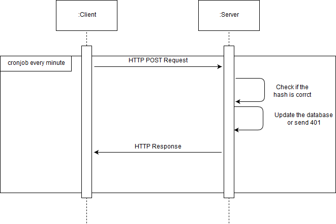
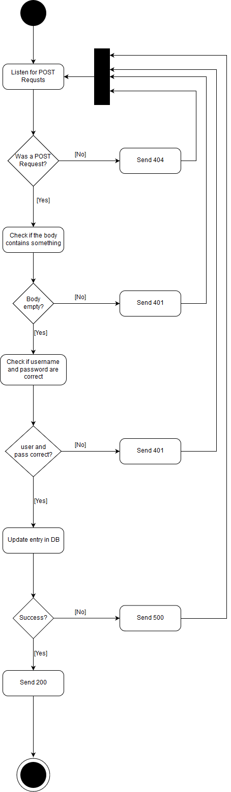
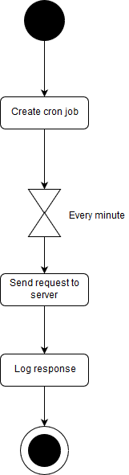

# DynKell

A DynDNS in Haskell

## Was ist ein DynDNS?

Dynamisches DNS oder DDNS ist eine Technik, um Domains im Domain Name System 
(DNS) dynamisch zu aktualisieren. Der Zweck ist, dass ein Computer (bspw. ein 
PC oder ein Router) nach dem Wechsel seiner IP-Adresse automatisch und schnell 
den dazugehörigen Domaineintrag ändert. So ist der Rechner immer unter demselben
Hostnamen erreichbar, auch wenn die aktuelle IP-Adresse für den Nutzer unbekannt 
ist.

## Funktion:

Die Domains werden auf dem Server, mit Benutzername und Password, in einer Datenbank 
hinterlegt. Per "POST" wird vom Client aus eine Anfrage gestartet, um die aktuelle
externe IP-Adresse des Routers zu ermitteln. 

## Installation:
Auf dem Dynkell-Server wird die Benutzung von MySQL vorrausgesetzt, da die Library 'HDBC' diese verwendet. Sollte auf Ihrem System MySQL fehlen, dann benutzen Sie den untenstehenden Link, um es einzurichten.
```
https://www.unixmen.com/install-mariadb-arch-linuxmanjaro/
```

Fuer die Ausfuehrung des Servers wird Docker vorrausgesetzt. Um Docker einzurichten wird der Guide vom Entwickler benutzt:
```
https://docs.docker.com/v17.09/engine/installation/
```
Docker Container werden mit den Befehlen erstellt.
```
docker build -t backend ./dynkellServer/
docker build -t frontend ./dynkellClient/
```

Starten Sie den Dynkell-Client / sowie -Server werden mit den Befehlen gestartet.
```
docker run --name dynkell_server -p 7000:7000 -d backend
docker run --name dynkell_client -p 7001:7001 -d frontend
```

Der Client muss im lokalen Netzwerk und der Server auf einem gehosteten Server im Internet gestartet werden.
Zudem wird eventuell ein Reverse Proxy benoetigt, um externe Anfragen auf den Server (dynkell backend) zu leiten.

## Funktionsweise:

Das gesamte Projekt funktioniert wie folgt:




Server:



Client:



